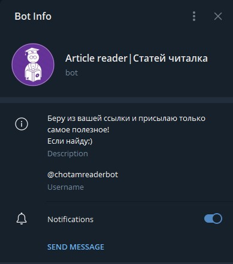

<h1 align="center" color="aqua">REPLIT BLOG TEMPLATE</h1>

A simple blog template. No framework or scripts. Keeping it simple allows for compatibility with Telegram Instant View. Telegram users can view and share a replit blog with ease.

## Blog Features:

- Main article
- '***Popular Posts***'
- '***About Me***'
- Link to Telegram channel

## Installation

> Just fork this repl!

<h2 align="center">Telegram Instant View</h3>

>Requires Telegram client (web, app, or desktop)
>

### There are several ways to get an Instant View Link
- The quickest and easiest way is to give your Replit Blog url to a bot like this one:
  
  

  
Article reader bot will respond with an instant view link for you to share.
  

   
  
  - You can write it yourself at https://telegra.ph.
     
    
    > Note: this method does not require the url of your Replit Blog. Talk to the Telegraph Bot first to get started.
    
    > You can add your blog's url to telegrams domain list. If your website is compatible, the telegram team will have to approve it first.
    
    > Or you can write the template yourself with the Instant View editor <a href="https://instantview.telegram.org/docs#instant-view-format">here</a>, in the ***My Templates*** section.

## License

MIT

## Author

- [@lesley-nicole](https://lesley-nicole.github.io)

